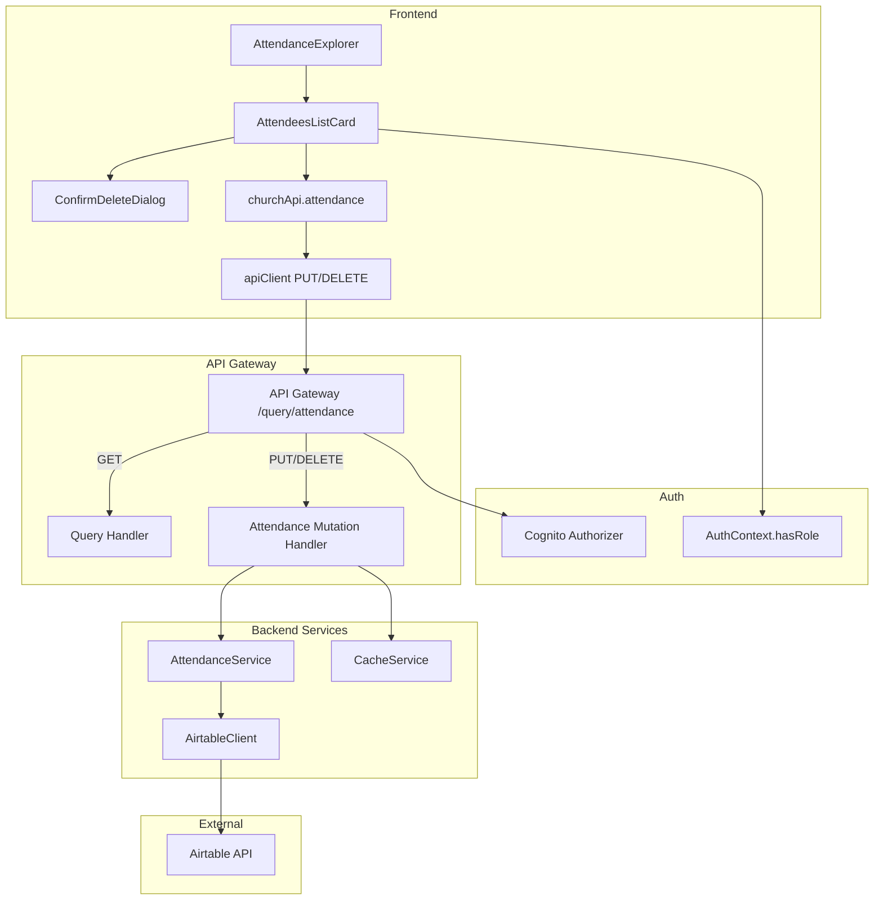

# Design Document: Attendance Record Management

## Overview

This feature extends the existing church member management system to support editing and deleting attendance records from the frontend. The design adds a `deleteRecord()` method to `AirtableClient`, `updateAttendance()` and `deleteAttendance()` methods to `AttendanceService`, a new attendance mutation Lambda handler, API Gateway PUT/DELETE routes on the existing `/query/attendance` resource, frontend API methods in `churchApi`, and inline edit/delete UI within the `AttendeesListCard` component. All mutation endpoints are protected by the existing Cognito authorizer, and the frontend gates UI controls based on the user's role from `AuthContext`.

## Architecture

The feature follows the existing layered architecture:



Key design decisions:
1. Reuse the existing `/query/attendance` API Gateway resource with new HTTP methods (PUT, DELETE) rather than creating a separate resource. This keeps the URL structure clean and consistent.
2. Create a separate Lambda handler for mutations rather than extending the read-only query handler. This maintains separation of concerns and allows independent scaling/monitoring.
3. Role checking happens at two levels: API Gateway (Cognito authorizer ensures authentication) and handler level (role extraction from JWT claims for `pastor`/`admin` authorization).

## Components and Interfaces

### Backend

#### 1. AirtableClient — New `deleteRecord()` Method

Added to `src/services/airtable-client.ts`:

```typescript
/**
 * Delete a record by ID
 */
async deleteRecord(tableId: string, recordId: string): Promise<void> {
  return this.executeWithRetry(async () => {
    await this.rateLimiter.acquire();
    const response = await fetch(this.buildUrl(tableId, recordId), {
      method: 'DELETE',
      headers: this.headers,
    });
    if (!response.ok) {
      throw await this.handleErrorResponse(response);
    }
  });
}
```

This follows the same pattern as `updateRecord()` — rate-limited, retry-capable, uses the existing error handling.

#### 2. AttendanceService — New Mutation Methods

Added to `src/services/attendance-service.ts`:

```typescript
/**
 * Update the Present? field of an attendance record
 */
async updateAttendance(recordId: string, present: boolean): Promise<AttendanceRecord> {
  if (!recordId || !recordId.trim()) {
    throw new AttendanceError(AttendanceErrorCode.INVALID_INPUT, 'Record ID is required');
  }
  // Verify record exists
  const existing = await this.airtableClient.getRecord(AIRTABLE_TABLES.ATTENDANCE, recordId);
  if (!existing) {
    throw new AttendanceError(AttendanceErrorCode.ATTENDANCE_NOT_FOUND, `Attendance record ${recordId} not found`);
  }
  const updated = await this.airtableClient.updateRecord(
    AIRTABLE_TABLES.ATTENDANCE, recordId, { 'Present?': present }
  );
  return this.mapRecordToAttendance(updated);
}

/**
 * Soft-delete: set Present? to false
 */
async softDeleteAttendance(recordId: string): Promise<AttendanceRecord> {
  return this.updateAttendance(recordId, false);
}

/**
 * Hard-delete: remove the Airtable record entirely
 */
async hardDeleteAttendance(recordId: string): Promise<{ deletedId: string }> {
  if (!recordId || !recordId.trim()) {
    throw new AttendanceError(AttendanceErrorCode.INVALID_INPUT, 'Record ID is required');
  }
  await this.airtableClient.deleteRecord(AIRTABLE_TABLES.ATTENDANCE, recordId);
  return { deletedId: recordId };
}
```

#### 3. Attendance Mutation Handler

New file `src/handlers/attendance-mutation.ts`:

```typescript
export const handler = async (event: APIGatewayProxyEvent): Promise<APIGatewayProxyResult> => {
  // Extract user context from Cognito JWT claims
  const userContext = extractUserContext(event);
  
  // Authorize: only pastor and admin roles
  if (!['pastor', 'admin'].includes(userContext.role)) {
    return errorResponse(403, 'Insufficient permissions. Only pastors and admins can modify attendance records.');
  }

  const method = event.httpMethod;

  if (method === 'PUT') {
    return handleUpdateAttendance(event, userContext);
  }
  if (method === 'DELETE') {
    return handleDeleteAttendance(event, userContext);
  }

  return errorResponse(405, 'Method not allowed');
};
```

The handler extracts the user role from `event.requestContext.authorizer.claims['cognito:groups']`, validates authorization, then delegates to update or delete logic. After successful mutations, it invalidates the relevant cache keys.

#### 4. User Context Extraction

```typescript
function extractUserContext(event: APIGatewayProxyEvent): { userId: string; email: string; role: string } {
  const claims = event.requestContext.authorizer?.claims || {};
  const groups = (claims['cognito:groups'] as string) || '';
  const groupList = groups.split(',').map(g => g.trim());
  
  let role = 'follow_up';
  if (groupList.includes('pastor')) role = 'pastor';
  else if (groupList.includes('admin')) role = 'admin';

  return {
    userId: claims.sub || '',
    email: claims.email || '',
    role,
  };
}
```

### Frontend

#### 5. churchApi — New Mutation Methods

Added to `frontend/src/services/church-api.ts` under `attendance`:

```typescript
attendance: {
  // ... existing methods ...

  updatePresence: (recordId: string, present: boolean) =>
    apiClient.put<AttendanceRecord>(
      `/query/attendance`, { recordId, present }
    ),

  softDelete: (recordId: string) =>
    apiClient.delete<AttendanceRecord>(
      `/query/attendance?recordId=${recordId}&deleteType=soft`
    ),

  hardDelete: (recordId: string) =>
    apiClient.delete<{ deletedId: string }>(
      `/query/attendance?recordId=${recordId}&deleteType=hard`
    ),
},
```

#### 6. ConfirmDeleteDialog Component

New component `frontend/src/components/attendance/ConfirmDeleteDialog.tsx`:

A modal dialog that:
- Accepts `attendeeName`, `onSoftDelete`, `onHardDelete`, `onCancel`, and `isLoading` props
- Displays the attendee name and explains the two delete options
- Soft-delete button: "Mark as Not Present" — sets `Present?` to false
- Hard-delete button: "Remove Record Permanently" — deletes from Airtable
- Cancel button closes the dialog
- Disables buttons while `isLoading` is true

#### 7. AttendeesListCard — Inline Edit/Delete

The existing `AttendeesListCard` component is extended to:
- Accept a new `userRole` prop (from `AuthContext`)
- Accept `onUpdatePresence` and `onDelete` callback props
- Render a presence toggle (checkbox/switch) and delete button per row when `userRole` is `pastor` or `admin`
- Show a loading spinner on the row during mutation
- Revert UI state on error

#### 8. AttendanceExplorer — Wiring

The `AttendanceExplorer` page is updated to:
- Import `useAuth` to get the current user's role
- Pass role and mutation callbacks to `AttendeesListCard`
- Handle mutation API calls, error display, and data refresh after success
- Manage `ConfirmDeleteDialog` open/close state

### CDK Stack

#### 9. API Gateway — New Methods

In `lib/airtable-member-management-stack.ts`, the existing `queryResource.addResource('attendance')` call is updated. Since `addResource` returns the resource, we store it and add PUT and DELETE methods pointing to the new mutation handler Lambda:

```typescript
const attendanceResource = queryResource.addResource('attendance');

// Existing GET
attendanceResource.addMethod('GET', new apigateway.LambdaIntegration(queryHandler), authOptions);

// New PUT and DELETE for mutations
attendanceResource.addMethod('PUT', new apigateway.LambdaIntegration(attendanceMutationHandler), authOptions);
attendanceResource.addMethod('DELETE', new apigateway.LambdaIntegration(attendanceMutationHandler), authOptions);
```

A new `attendanceMutationHandler` Lambda is created with the same environment variables and role as the query handler.

## Data Models

### Request/Response Types

#### Update Attendance Request (PUT body)
```typescript
interface UpdateAttendanceRequest {
  recordId: string;
  present: boolean;
}
```

#### Delete Attendance Request (DELETE query params)
- `recordId: string` — the Airtable record ID
- `deleteType: 'soft' | 'hard'` — determines soft-delete vs hard-delete

#### Mutation Response (success)
```typescript
interface MutationResponse<T> {
  success: true;
  data: T;
  timestamp: string;
}
```

#### Mutation Response (error)
```typescript
interface MutationErrorResponse {
  success: false;
  error: string;
  details?: unknown;
  timestamp: string;
}
```

### Audit Log Entry (CloudWatch structured log)
```typescript
interface AuditLogEntry {
  action: 'UPDATE_ATTENDANCE' | 'SOFT_DELETE_ATTENDANCE' | 'HARD_DELETE_ATTENDANCE';
  recordId: string;
  userId: string;
  userEmail: string;
  timestamp: string;
  previousValue?: { present: boolean };
  newValue?: { present: boolean };
}
```

These response shapes match the existing `successResponse()` and `errorResponse()` patterns used in the query handler.


## Correctness Properties

*A property is a characteristic or behavior that should hold true across all valid executions of a system — essentially, a formal statement about what the system should do. Properties serve as the bridge between human-readable specifications and machine-verifiable correctness guarantees.*

### Property 1: Authorization accepts if and only if role is pastor or admin

*For any* user context with a Cognito role, the Mutation_Handler accepts the request if and only if the role is `pastor` or `admin`. All other roles receive a 403 response.

**Validates: Requirements 1.1, 1.2**

### Property 2: UI edit/delete controls visibility matches authorization

*For any* user role and attendee list, the AttendeesListCard renders edit (presence toggle) and delete controls on each row if and only if the user role is `pastor` or `admin`.

**Validates: Requirements 1.4, 1.5**

### Property 3: Update attendance returns record with correct present value

*For any* valid attendance record ID and boolean `present` value, calling `updateAttendance(recordId, present)` returns an `AttendanceRecord` whose `present` field equals the provided value. This also covers soft-delete, which is `updateAttendance(recordId, false)`.

**Validates: Requirements 2.1, 3.1, 3.2**

### Property 4: Cache invalidation after any successful mutation

*For any* successful attendance mutation (update, soft-delete, or hard-delete), all cached attendance data for the affected service is invalidated immediately after the operation completes.

**Validates: Requirements 2.4, 4.4**

### Property 5: Hard-delete removes record and returns the deleted ID

*For any* valid attendance record ID, calling `hardDeleteAttendance(recordId)` invokes `deleteRecord` on the AirtableClient and returns a response containing the same record ID that was passed in.

**Validates: Requirements 4.1, 4.2**

### Property 6: Each attendee row renders action controls for authorized users

*For any* non-empty list of attendees and an authorized user role, every attendee row in the rendered AttendeesListCard contains exactly one presence toggle and one delete button.

**Validates: Requirements 6.1**

### Property 7: Handler routes mutations to correct service method

*For any* valid mutation request, the handler routes PUT requests to `updateAttendance` using the `recordId` and `present` fields from the body, and routes DELETE requests to `softDeleteAttendance` or `hardDeleteAttendance` based on the `deleteType` query parameter.

**Validates: Requirements 7.3, 7.4**

### Property 8: Audit log entries contain all required fields

*For any* attendance mutation (update, soft-delete, or hard-delete), the structured audit log entry contains the action type, record ID, user ID, user email, ISO timestamp, and the previous and new values of the modified field.

**Validates: Requirements 8.1, 8.2**

## Error Handling

### Backend Errors

| Error Scenario | Error Code | HTTP Status | Handling |
|---|---|---|---|
| Missing or empty record ID | `INVALID_INPUT` | 400 | AttendanceService validates input before Airtable call |
| Record not found in Airtable | `ATTENDANCE_NOT_FOUND` | 404 | AirtableClient returns NOT_FOUND, service wraps in AttendanceError |
| Unauthorized role | N/A | 403 | Handler checks role before processing |
| Airtable rate limit (429) | `AIRTABLE_RATE_LIMITED` | 502 | AirtableClient retries with exponential backoff (up to 5 retries) |
| Airtable server error (5xx) | `AIRTABLE_API_ERROR` | 502 | AirtableClient retries with exponential backoff |
| Invalid request body (malformed JSON) | `INVALID_REQUEST` | 400 | Handler catches JSON parse errors |
| Invalid deleteType parameter | `INVALID_INPUT` | 400 | Handler validates deleteType is 'soft' or 'hard' |

### Frontend Error Handling

- API errors are caught in the mutation callbacks and displayed as toast/notification messages
- On mutation failure, the UI reverts to the previous state (optimistic update rollback)
- Network errors trigger the existing retry logic in `apiClient`
- Loading states prevent double-submission during in-flight mutations

### Error Response Format

All error responses follow the existing pattern:
```json
{
  "success": false,
  "error": "Human-readable error message",
  "details": "Optional additional context",
  "timestamp": "2024-01-01T00:00:00.000Z"
}
```

## Testing Strategy

### Testing Framework

- Backend: Jest (existing `jest.config.js`)
- Frontend: Vitest (existing `vitest.config.ts`)
- Property-based testing: `fast-check` with Jest (already installed as a dependency)

### Unit Tests

Unit tests cover specific examples and edge cases:

- `AttendanceService.updateAttendance()` with valid input returns updated record
- `AttendanceService.updateAttendance()` with non-existent record throws `ATTENDANCE_NOT_FOUND`
- `AttendanceService.softDeleteAttendance()` sets present to false
- `AttendanceService.hardDeleteAttendance()` calls `deleteRecord` and returns ID
- `AttendanceService.hardDeleteAttendance()` with non-existent record throws error
- `AirtableClient.deleteRecord()` sends DELETE request with correct URL
- `AirtableClient.deleteRecord()` with 404 response throws NOT_FOUND error
- Mutation handler returns 403 for `follow_up` role
- Mutation handler returns 403 for `department_lead` role
- Mutation handler returns 400 for missing recordId
- Mutation handler returns 400 for invalid deleteType
- ConfirmDeleteDialog renders both soft-delete and hard-delete options
- ConfirmDeleteDialog cancel button closes without API call
- AttendeesListCard hides controls for unauthorized roles

### Property-Based Tests

Property tests validate universal correctness properties using `fast-check`. Each test runs a minimum of 100 iterations.

| Property | Test File | Description |
|---|---|---|
| Property 1 | `test/attendance-mutation-handler.property.test.ts` | Generate random user roles, verify handler accepts iff pastor/admin |
| Property 3 | `test/attendance-service-mutation.property.test.ts` | Generate random record IDs and boolean values, verify returned record matches |
| Property 5 | `test/attendance-service-mutation.property.test.ts` | Generate random record IDs, verify hard-delete returns same ID |
| Property 7 | `test/attendance-mutation-handler.property.test.ts` | Generate random valid requests, verify correct routing |
| Property 8 | `test/attendance-mutation-handler.property.test.ts` | Generate random mutations, verify audit log structure |

Each property test is tagged with: `Feature: attendance-record-management, Property {N}: {title}`

### Test Configuration

```typescript
// fast-check configuration for property tests
fc.assert(
  fc.property(
    // generators...
    (input) => {
      // property assertion...
    }
  ),
  { numRuns: 100 }
);
```
