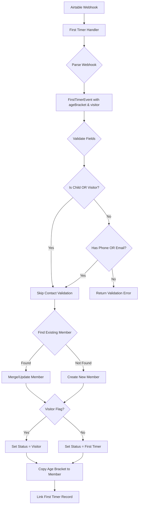

# Design Document: First Timer Age Bracket and Visitor Fields

## Overview

This design extends the first-timer registration flow to support two new fields: Age Bracket and Visitor. These fields affect member creation in two ways:

1. **Data Flow**: Age Bracket is copied directly to the linked member record
2. **Status Determination**: When Visitor is true, the member status is set to "Visitor" instead of "First Timer"
3. **Validation Relaxation**: When Age Bracket is "Child" OR Visitor is true, contact information (phone, email, address) is not required

The changes are localized to:
- Type definitions (`src/types/index.ts`)
- First-timer handler (`src/handlers/first-timer.ts`)
- Member service (`src/services/member-service.ts`)

## Architecture



## Components and Interfaces

### Type Updates

#### MemberStatus Type Extension
```typescript
// Current
export type MemberStatus = 'Member' | 'First Timer' | 'Returner' | 'Evangelism Contact';

// Updated
export type MemberStatus = 'Member' | 'First Timer' | 'Returner' | 'Evangelism Contact' | 'Visitor';
```

#### FirstTimerEvent Interface Extension
```typescript
export interface FirstTimerEvent {
  recordId: string;
  firstName: string;
  lastName: string;
  phone?: string;
  email?: string;
  address?: string;
  ghanaPostCode?: string;
  serviceId?: string;
  // New fields
  ageBracket?: string | null;  // e.g., "Child", "Adult", "Senior"
  visitor?: boolean | null;
}
```

#### FirstTimerWebhookPayload Fields Extension
```typescript
fields: {
  // ... existing fields
  "Age Bracket"?: string;
  "Visitor?"?: boolean;
}
```

#### CreateMemberInput Interface Extension
```typescript
export interface CreateMemberInput {
  // ... existing fields
  ageBracket?: string;  // New field
}
```

### Handler Changes

#### parseFirstTimerWebhook Function
Extract the new fields from the webhook payload:
```typescript
return {
  // ... existing fields
  ageBracket: fields["Age Bracket"] || null,
  visitor: fields["Visitor?"] || null,
};
```

#### Validation Logic Update
Replace the current validation:
```typescript
// Current
if (!event.phone && !event.email) {
  return { success: false, error: "At least one of phone or email is required" };
}

// Updated
const isChildOrVisitor = event.ageBracket === 'Child' || event.visitor === true;
if (!isChildOrVisitor && !event.phone && !event.email) {
  return { success: false, error: "At least one of phone or email is required" };
}
```

#### Status Determination
When creating or updating a member:
```typescript
const memberStatus: MemberStatus = event.visitor ? 'Visitor' : 'First Timer';
```

### Service Changes

#### MemberService.createMember
- Accept `ageBracket` in input
- Map to Airtable field `"Age Bracket"`
- Skip phone/email validation when creating for child/visitor (validation happens in handler)

#### MemberService Validation Update
The member service currently validates phone/email. This needs to be conditional:
```typescript
// In createMember, add parameter to skip validation
async createMember(input: CreateMemberInput, skipContactValidation = false): Promise<Member>

// Or check ageBracket in input
if (!input.phone && !input.email && input.ageBracket !== 'Child') {
  throw new MemberError(...);
}
```

## Data Models

### Airtable Field Mappings

| FirstTimerEvent Field | Airtable Field (First Timers Register) | Airtable Field (Members)|
|----------------------|----------------------------------------|--------------------------|
| ageBracket           | "Age Bracket"                          | "Age Bracket"            |
| visitor              | "Visitor?"                             | N/A (affects Status)     |

### Status Mapping Logic

| Visitor Field | Existing Member Status | Resulting Status |
|---------------|------------------------|------------------|
| true          | N/A (new member)       | "Visitor"        |
| true          | "Evangelism Contact"   | "Visitor"        |
| false/null    | N/A (new member)       | "First Timer"    |
| false/null    | "Evangelism Contact"   | "First Timer"    |

### Validation Matrix

| Age Bracket | Visitor | Phone/Email Required|
|-------------|---------|---------------------|
| "Child"     | any     | No                  |
| any         | true    | No                  |
| not "Child" | false   | Yes                 |
| not "Child" | null    | Yes                 |
| null        | false   | Yes                 |
| null        | null    | Yes                 |


## Correctness Properties

*A property is a characteristic or behavior that should hold true across all valid executions of a system—essentially, a formal statement about what the system should do. Properties serve as the bridge between human-readable specifications and machine-verifiable correctness guarantees.*

Based on the prework analysis, the following properties have been consolidated to eliminate redundancy:

### Property 1: Webhook Parsing Extracts New Fields

*For any* webhook payload containing Age Bracket and/or Visitor fields, parsing the webhook SHALL produce a FirstTimerEvent with the correct ageBracket and visitor values matching the input payload.

**Validates: Requirements 1.1, 1.3, 2.1**

### Property 2: Status Determination Based on Visitor Flag

*For any* first-timer registration processed by the handler:
- If visitor is true, the linked member's status SHALL be "Visitor"
- If visitor is false or null, the linked member's status SHALL be "First Timer"

This applies both to new member creation and to updating existing Evangelism Contacts.

**Validates: Requirements 2.2, 2.3, 2.4**

### Property 3: Validation Relaxed for Children and Visitors

*For any* first-timer registration where ageBracket equals "Child" OR visitor equals true, the handler SHALL successfully process the registration even when phone, email, and address are all missing.

**Validates: Requirements 3.1, 4.1, 5.1**

### Property 4: Validation Requires Contact for Non-Children Non-Visitors

*For any* first-timer registration where ageBracket does NOT equal "Child" AND visitor is NOT true, the handler SHALL require at least phone or email, returning a validation error if both are missing.

**Validates: Requirements 3.3, 4.3, 5.2**

### Property 5: Age Bracket Flows to Linked Member

*For any* first-timer registration with an ageBracket value, the linked member record SHALL have the same Age Bracket value copied to it.

**Validates: Requirements 1.2**

### Property 6: Member Creation Succeeds Without Contact for Children/Visitors

*For any* first-timer registration where ageBracket equals "Child" OR visitor equals true, the Member_Service SHALL successfully create a member record even when phone, email, and address are empty.

**Validates: Requirements 3.2, 4.2**

## Error Handling

### Validation Errors

| Condition | Error Message | HTTP Status |
|-----------|---------------|-------------|
| Missing first name or last name | "First name and last name are required" | 400 |
| Missing phone AND email (when not child/visitor) | "At least one of phone or email is required" | 400 |

### Edge Cases

1. **Null vs Undefined**: Both `null` and `undefined` for ageBracket/visitor should be treated as "not provided"
2. **Empty String Age Bracket**: An empty string for Age Bracket should be treated as null
3. **Case Sensitivity**: Age Bracket comparison for "Child" should be case-insensitive to handle variations like "child" or "CHILD"

### Backward Compatibility

- Existing webhooks without Age Bracket or Visitor fields will continue to work
- The validation logic defaults to requiring contact info when new fields are absent
- No changes to existing member records or statuses

## Testing Strategy

### Property-Based Testing

Property-based tests will use `fast-check` library (already in use in the project) to verify the correctness properties. Each property test should run a minimum of 100 iterations.

**Test Configuration:**
- Library: fast-check
- Minimum iterations: 100 per property
- Tag format: `Feature: first-timer-age-visitor-fields, Property N: [property description]`

### Test Generators

Extend existing generators to include new fields:

```typescript
const ageBracketGenerator = fc.oneof(
  fc.constant('Child'),
  fc.constant('Adult'),
  fc.constant('Senior'),
  fc.constant(null),
  fc.constant(undefined)
);

const visitorGenerator = fc.oneof(
  fc.constant(true),
  fc.constant(false),
  fc.constant(null),
  fc.constant(undefined)
);

const firstTimerEventWithNewFieldsGenerator = fc.record({
  // ... existing fields
  ageBracket: ageBracketGenerator,
  visitor: visitorGenerator,
});
```

### Unit Tests

Unit tests should cover specific examples and edge cases:

1. **Parsing edge cases**: Empty strings, whitespace, case variations
2. **Validation boundary cases**: Exactly at the boundary of child/visitor rules
3. **Integration with existing flows**: Ensure existing Evangelism Contact merge still works with new fields

### Test File Location

Tests should be added to `test/first-timer-handler.property.test.ts` to extend the existing property test suite.
